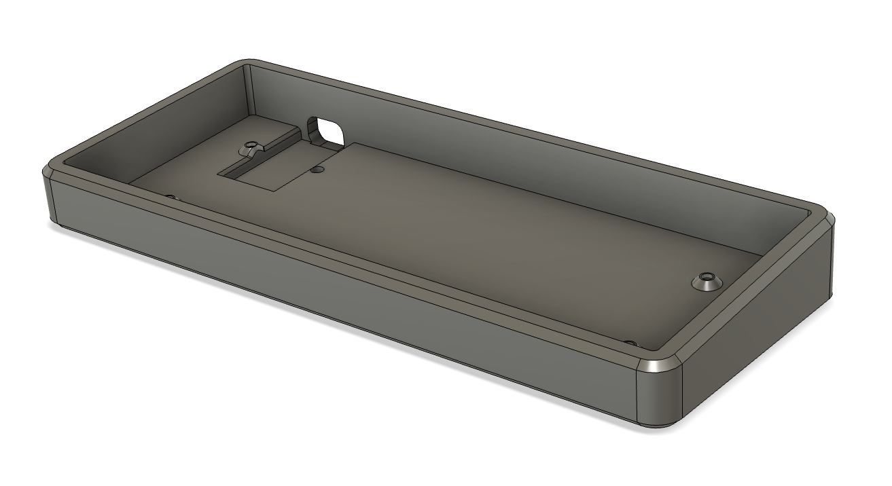
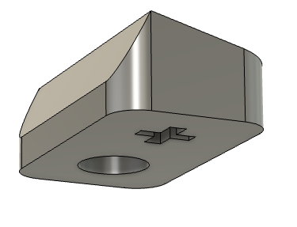
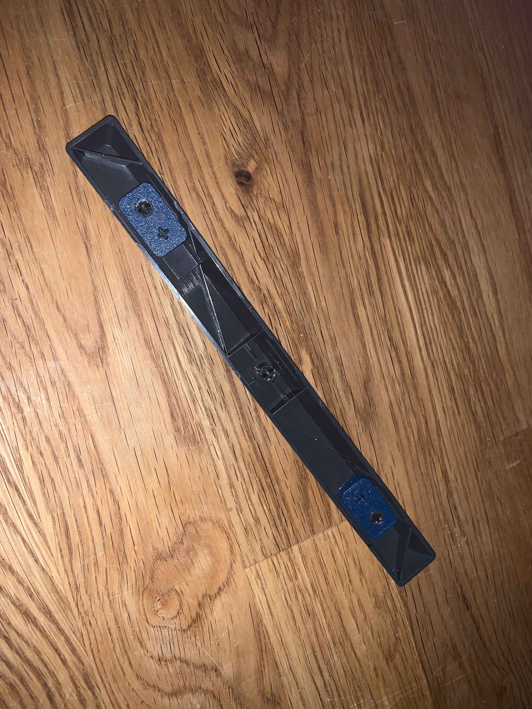

# Yasui Angle Case

A case for Rainkeebs' Yasui with a 5 degree typing angle.

Based heavily on Rain's case (although remodeled), so supports the same
M2 heatset inserts for mounting. It's probably possible to convert it to
self-tapping if you don't want to use heatsets.. 

The angle is actually parameterised in the fusion model, although you'll have 
to do some manual tweaking of the floor height if you want a very low angle.

## Stab adaptor

I don't have an 8u stab wire so I printed some adaptors for the 10u bar, stl and fusion source is included.

You'll need to print two, one mirrored:

The offset amount is parameterised in the fusion file if you want to make one for a different ratio.
